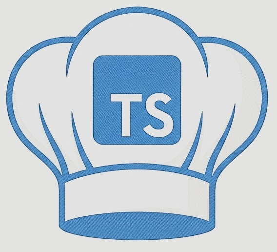

<p align="center">
  
</p>

<h1 align="center">ts-chef</h1>

<p align="center">
  <strong>CyberChef-style data transformations directly inside Visual Studio Code.</strong>
</p>

<p align="center">
  <a href="https://marketplace.visualstudio.com/items?itemName=michaelweiss.ts-chef">
    
  </a>
  <a href="https://github.com/MichaelWeissDEV/ts-chef/actions/workflows/ci.yml">
    
  </a>
  <a href="https://github.com/MichaelWeissDEV/ts-chef/blob/master/LICENSE">
    
  </a>
</p>

## Overview

`ts-chef` is a Visual Studio Code extension for transforming, decoding, encoding, inspecting, and analyzing data without leaving the editor. It brings a CyberChef-inspired workflow into VS Code, with a TypeScript-based operation engine and editor-focused tools for day-to-day security, development, and troubleshooting work.

Use it to inspect encoded strings, build repeatable transformation pipelines, decode suspicious payloads, format structured data, calculate hashes, test ciphers, and quickly move between raw input and usable output.

## Features

- **480+ operations** for encoding, decoding, hashing, compression, cryptography, parsing, formatting, images, and text processing.
- **Quick Convert** for applying suggested transformations directly to selected editor text.
- **Pipeline Editor** for composing multi-step recipes with configurable operation arguments.
- **Pattern scanning** to detect Base64, hex, URLs, and other recognizable data in documents.
- **Inline highlighting and hovers** for discovered patterns and quick conversion previews.
- **Saved pipelines** for reusable workflows, stored per-workspace or system-wide (global) so they are available in every workspace.
- **Variable support** for storing values and reusing them in later pipeline steps.
- **Deep Analysis** for exploring selected data and identifying likely formats or encodings.

## Installation

Install `ts-chef` from the [Visual Studio Marketplace](https://marketplace.visualstudio.com/items?itemName=michaelweiss.ts-chef), or search for `ts-chef` in the VS Code Extensions view.

Requirements:

- Visual Studio Code `1.85.0` or newer

## Usage

### Quick Convert

1. Select text in the editor.
2. Open the context menu.
3. Choose **tschef: Quick Convert Selection**.
4. Pick one of the suggested transformations.

### Pipeline Editor

1. Open the command palette.
2. Run **tschef: Open Pipeline Editor**.
3. Add operations, configure their arguments, and bake the selected input.
4. Save pipelines when you want to reuse a recipe later. Choose **Global** (available in every workspace) or **Workspace** in the scope selector next to Save — global is the default.

### Document Scanning

Run **tschef: Scan Document for Patterns** to find recognizable encoded or structured values in the current document. Detected values can be highlighted in the editor and inspected through hover actions.

Useful settings:

- `tschef.highlightingEnabled` controls editor highlighting.
- `tschef.confidenceThreshold` controls when hover conversion options are shown.
- `tschef.autoScanOnSave` scans documents automatically when they are saved.

## Documentation

- [Repository](https://github.com/MichaelWeissDEV/ts-chef)
- [Wiki](https://github.com/MichaelWeissDEV/ts-chef/wiki)
- [Usage Guide](docs/usage.md)
- [Contributing Guide](docs/contributing.md)
- [Operations Index](https://github.com/MichaelWeissDEV/ts-chef/wiki/Operations)
- [Test and Coverage Reports](https://github.com/MichaelWeissDEV/ts-chef/wiki/test-report)

## Development

Clone the repository and install dependencies:

```bash
git clone https://github.com/MichaelWeissDEV/ts-chef.git
cd ts-chef
npm install
```

Common commands:

```bash
npm run build
npm test
npm run lint
npm run package
```

Project layout:

- `src/extension.ts` contains the VS Code extension entry point.
- `src/chef/` contains the TypeScript operation engine.
- `src/chef/operations/` contains individual transformation operations.
- `src/providers/` contains VS Code tree, hover, scan, and decoration providers.
- `src/panels/` contains the pipeline editor webview.
- `test/` contains the test suite.

## License

This project is licensed under the [Apache License 2.0](https://github.com/MichaelWeissDEV/ts-chef/blob/master/LICENSE).

Many operations are ported from [GCHQ CyberChef](https://github.com/gchq/CyberChef), which is also licensed under Apache 2.0.
